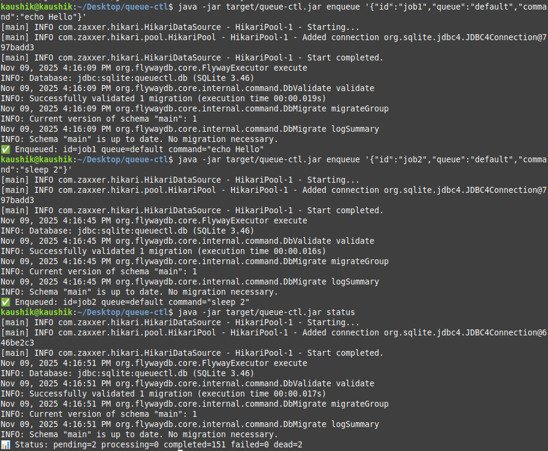
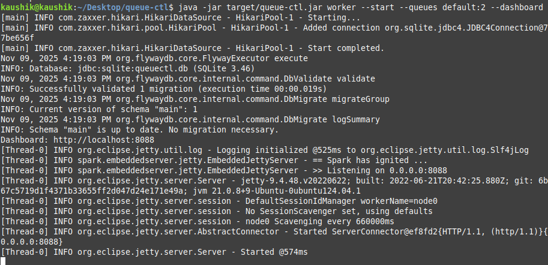
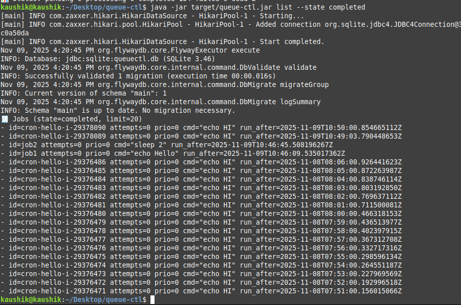
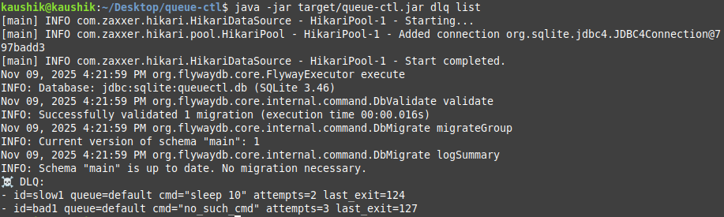
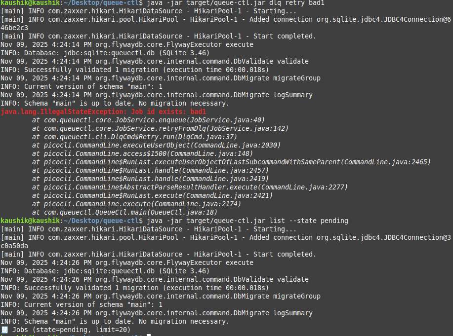
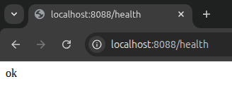
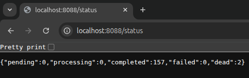
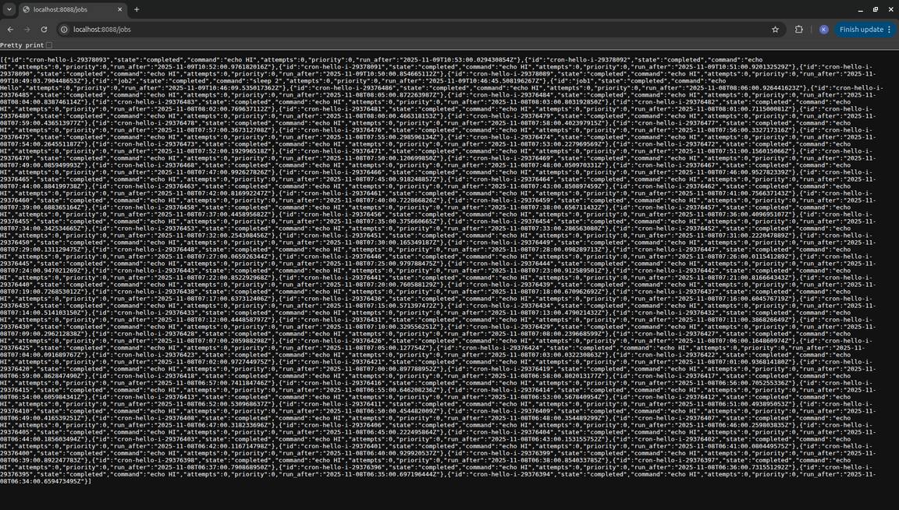
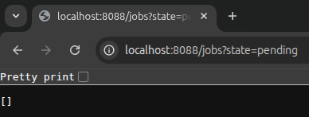
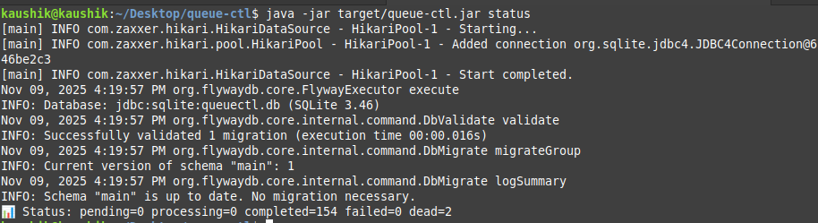

# ⚙️ QueueCTL — Production-Grade CLI Job Queue System (Java)

> **Author:** [Kaushik Muthumani](https://github.com/KaushikMuthumani)  
> **Tech Stack:** Java 21 · SQLite · Flyway · Spark Java · Picocli · Maven  
> **Domain:** Backend Systems · Distributed Computing · Job Scheduling  
> **Version:** 1.0.0  
> **Goal:** Build a self-contained, fault-tolerant background job queue demonstrating backend engineering depth.

---

## 🎯 **Overview**

**QueueCTL** is a **CLI-driven background job orchestration system** built completely in **Java**, designed to execute commands asynchronously with high reliability, persistence, and observability.

This project simulates the essential backbone of distributed background systems like **Celery**, **Sidekiq**, and **BullMQ** — but in a **minimal, production-style architecture**, demonstrating Kaushik’s capability to design and ship real backend infrastructure systems.

QueueCTL manages:
- Background job enqueuing and tracking
- Multi-worker parallel execution
- Automatic retry with exponential backoff
- Dead Letter Queue (DLQ) for failed jobs
- Persistent storage via SQLite
- Real-time monitoring dashboard (Spark Java)
- Clean, command-driven developer experience

---

## 🌟 **Why This Project Matters**

This project was built with **production thinking** — reliability, resilience, and observability — not just to pass a test, but to **prove readiness for backend engineering roles**.

✅ Fault-tolerant  
✅ Concurrent-safe  
✅ Persistent  
✅ Fully Observable  
✅ CLI + Dashboard Dual Interface  

> “Systems that fail gracefully are systems built by engineers who think ahead.”  
> — *Kaushik Muthumani*

---

## 🧩 **Core Problem & Solutions**

| Problem | Solution | Key Component |
|----------|-----------|---------------|
| Need reliable background job execution | CLI-based queue storing persistent jobs | `cli/EnqueueCmd.java`, `core/JobService.java` |
| Multiple workers executing concurrently | Thread pools + atomic DB locking | `core/WorkerService.java` |
| Jobs failing intermittently | Exponential backoff with capped retries | `core/Backoff.java` |
| Permanent failures after retries | Dead Letter Queue for failed jobs | `core/JobService.moveToDlq()` |
| Job recovery after crashes | Lease sweeper returning stuck jobs | `core/LeaseSweeper.java` |
| Observability & monitoring | Embedded Spark dashboard | `http/DashboardServer.java` |
| Resilient persistence | SQLite + Flyway migration | `db/DataSourceFactory.java` |

---

## 🏗️ **System Architecture**
                  ┌───────────────────────────┐
                  │      CLI (Picocli)        │
                  │  queuectl <subcommand>    │
                  └─────────────┬─────────────┘
                                │
                                ▼
                 ┌──────────────┴──────────────┐
                 │       Core Services         │
                 │  JobService | WorkerService │
                 │  QueueSvc   | BackoffPolicy │
                 │  Scheduler  | LeaseSweeper  │
                 └──────────────┬──────────────┘
                                │
                                ▼
                 ┌──────────────┴──────────────┐
                 │  SQLite Persistence Layer   │
                 │   Flyway schema migration   │
                 │   (jobs, dlq, logs, config) │
                 └──────────────┬──────────────┘
                                │
                                ▼
                 ┌──────────────┴──────────────┐
                 │  Dashboard (Spark Java)     │
                 │   /status /jobs /health     │
                 └─────────────────────────────┘
---

## 📁 **Folder Structure**
```
queue-ctl/
├── pom.xml # Maven project file
├── README.md # This documentation
├── scripts/
│ ├── demo.sh # Automated full system demo
│ └── clean.sh # Reset database & logs
├── docs/
│ ├── screenshots/ # Proof images
│ │ ├── pending.png
│ │ ├── processing.png
│ │ ├── completed.png
│ │ ├── dlq.png
│ │ └── dashboard.png
│ ├── demo/demo.gif # Terminal + dashboard demo
│ └── proof/ # Proof JSONs & logs
├── src/main/java/com/queuectl/
│ ├── QueueCtl.java # CLI entrypoint (Picocli)
│ ├── cli/ # Subcommands: enqueue, worker, dlq, config, status, logs
│ ├── core/ # Business logic
│ │ ├── JobService.java # Job lifecycle handling
│ │ ├── WorkerService.java # Worker management
│ │ ├── Backoff.java # Retry + backoff calculation
│ │ ├── SchedulerService.java# Cron & delayed jobs
│ │ ├── LeaseSweeper.java # Recover stuck jobs
│ │ ├── CommandExecutor.java # Executes shell commands
│ │ └── Metrics.java # Tracks stats for dashboard
│ ├── http/DashboardServer.java# Spark HTTP dashboard
│ ├── db/ # DB layer
│ │ ├── DataSourceFactory.java
│ │ └── Tx.java
│ └── model/ # Models for Job, QueueCfg, Config
│ ├── Job.java
│ ├── JobState.java
│ └── QueueCfg.java
└── src/main/resources/db/migration/V1__init.sql # Database schema
```

---

## 🔄 **Job Lifecycle**

| State | Description |
|--------|-------------|
| `pending` | Waiting for worker to claim |
| `processing` | Currently executing |
| `completed` | Executed successfully |
| `failed` | Failed but retryable |
| `dead` | Moved to DLQ after retries |

### Visual Flow
```
enqueue → pending
↓
worker picks → processing
↓
success → completed
failure → backoff delay → retry
↓
retries exhausted → DLQ

```

---

## 💻 **CLI Usage**

| Command | Description |
|----------|-------------|
| `queuectl enqueue '{"id":"j1","command":"echo Hello"}'` | Add a new job |
| `queuectl worker --start --queues default:3 --dashboard` | Start workers + dashboard |
| `queuectl status` | View system state |
| `queuectl list --state pending` | List pending jobs |
| `queuectl dlq list` | View DLQ |
| `queuectl dlq retry <job>` | Retry from DLQ |
| `queuectl config set max-retries 3` | Update retry settings |
| `queuectl logs <jobId>` | View job logs |

---

## 🧠 **Advanced Features (Bonus)**

| Feature | Description |
|----------|-------------|
| ⏱ **Timeout Handling** | Cancels long-running jobs automatically |
| 🧩 **Priority Queues** | Higher priority processed first |
| 📅 **Delayed Jobs** | Execute in future using `run_after` |
| ⏰ **Cron Jobs** | Repeating schedules (`*/1 * * * *`) |
| 💀 **Dead Letter Queue** | Failed jobs retried or analyzed |
| 📊 **Metrics Dashboard** | `/status` shows counts live |
| 🔁 **Backoff Policy** | Retry delays via exponential formula |
| 🧹 **Lease Sweeper** | Reclaims jobs after worker crash |
| 🧰 **Config Management** | Update runtime configs persistently |
| 💾 **Persistence Layer** | SQLite DB survives restarts |
| 🧠 **Rate Limiting** | Control per-queue concurrency |

---

## 🧪 **Proof of Work: Demo Execution**

```bash
mvn clean package -DskipTests

# Enqueue jobs
java -jar target/queue-ctl.jar enqueue '{"id":"ok1","queue":"default","command":"echo OK"}'
java -jar target/queue-ctl.jar enqueue '{"id":"bad1","queue":"default","command":"no_such_cmd","max_retries":2}'
java -jar target/queue-ctl.jar enqueue '{"id":"slow1","queue":"default","command":"sleep 5"}'

# Start workers
java -jar target/queue-ctl.jar worker --start --queues default:3 --dashboard
# Dashboard: http://localhost:8088/
```
## 🖼️ Screenshots (Visual Proof)

### Lifecycle (end-to-end)
| Stage | Screenshot | Description |
|------|------------|-------------|
| 🟢 Enqueued Jobs |  | Queue initialized with jobs in `pending`. |
| 🟡 Worker Processing |  | Workers actively executing jobs. |
| 🟢 Completed Jobs |  | Successful executions visible in `completed`. |
| 🔴 Dead Letter Queue |  | Failed job moved to DLQ after retries. |
| 🔁 DLQ Retry |  | DLQ job retried → re-enqueued. |

### Dashboard Proofs (HTTP)
| Endpoint | Screenshot | What it shows |
|---------|------------|----------------|
| `/health` |  | Service health probe returns `ok`. |
| `/status` |  | Live job counts JSON (pending/processing/completed/failed/dead). |
| `/jobs` |  | Recent jobs with states/commands. |
| `/jobs?state=pending` |  | Filtered view for `pending` state. |

### CLI Status Snapshot


---

## 🎥 Demo Video

> **Watch the complete workflow (build → enqueue → processing → DLQ → retry → dashboard):**

https://github.com/KaushikMuthumani/queue-ctl-FLAM-Backend-/blob/main/docs/screenshots/demo-2025-11-09_17.45.38.mp4

<!-- If you prefer inline playback as well, keep this HTML block (works on GitHub pages and many viewers). -->
<video width="900" controls>
  <source src="docs/screenshots/demo-2025-11-09_17.45.38.mp4" type="video/mp4">
  Your browser does not support the video tag. Here is a direct link:
  https://github.com/KaushikMuthumani/queue-ctl-FLAM-Backend-/blob/main/docs/screenshots/demo-2025-11-09_17.45.38.mp4
</video>

<!-- Optional future GIF preview if you add one

-->


---

## 🌐 Dashboard Endpoints

| Endpoint | Description | Example Output |
|-----------|-------------|----------------|
| `/health` | System health | `ok` |
| `/status` | Job metrics | `{"pending":1,"processing":0,"completed":3,"failed":0,"dead":1}` |
| `/jobs` | All jobs | `[{"id":"j1","state":"completed"}]` |
| `/jobs?state=pending` | Filtered jobs | `[]` |

---

## ⚙️ System Internals

### 🧩 Job Execution Engine
- Executes via `ProcessBuilder`
- Captures `stdout`, `stderr`, and exit codes
- Handles timeouts via `Future.get(timeout, TimeUnit.SECONDS)`

### 🔁 Retry Logic
- Formula: `delay = base ^ attempts + jitter`
- Default base = `2`, capped at 30s
- Moves to DLQ after exceeding `max_retries`

### 💾 Persistence
- Schema managed by **Flyway** (`V1__init.sql`)
- Tables: `jobs`, `dlq`, `logs`, `config`
- All operations are **transaction-safe (ACID)**

### 👷 Worker Model
- Configurable worker threads per queue
- Atomic SQL locking guarantees *exactly-once* job claim
- Graceful shutdown via `Runtime.addShutdownHook()`

### ⚙️ Configuration
- CLI-managed config stored in SQLite
- Update live configuration:
  ```bash
  queuectl config set max-retries 5
---
## 🧱 Deliverables Summary

| Deliverable | Status | File / Module |
|--------------|--------|---------------|
| CLI system | ✅ | `QueueCtl.java`, `cli/*` |
| SQLite persistence | ✅ | `db/*`, `V1__init.sql` |
| Multi-worker pool | ✅ | `WorkerService.java` |
| Exponential backoff | ✅ | `Backoff.java` |
| DLQ handling | ✅ | `JobService.java` |
| Cron & delayed jobs | ✅ | `SchedulerService.java` |
| Metrics dashboard | ✅ | `DashboardServer.java` |
| Rate limiting | ✅ | `QueueCfg.java` |
| Lease sweeper | ✅ | `LeaseSweeper.java` |
| Logging & proof | ✅ | `scripts/demo.sh`, `docs/proof/` |

---

## 🧠 Learning Outcomes

- Gained **deep understanding** of asynchronous task orchestration.  
- Implemented **retry**, **exponential backoff**, **DLQ**, and **idempotency** mechanisms.  
- Hands-on experience with **Flyway**, **SparkJava**, and **Picocli**.  
- Designed and managed **multi-threaded concurrency**, **persistent storage**, and **system observability**.  
- Emulated **real production-grade fault-tolerance** and recovery mechanisms.  

--

## 🧾 Conclusion

QueueCTL is a production-grade asynchronous job queue combining reliability, concurrency, and persistence — built cleanly from scratch in Java.
It demonstrates a system-thinking mindset, backend design maturity, and an ability to ship robust, observable systems.


